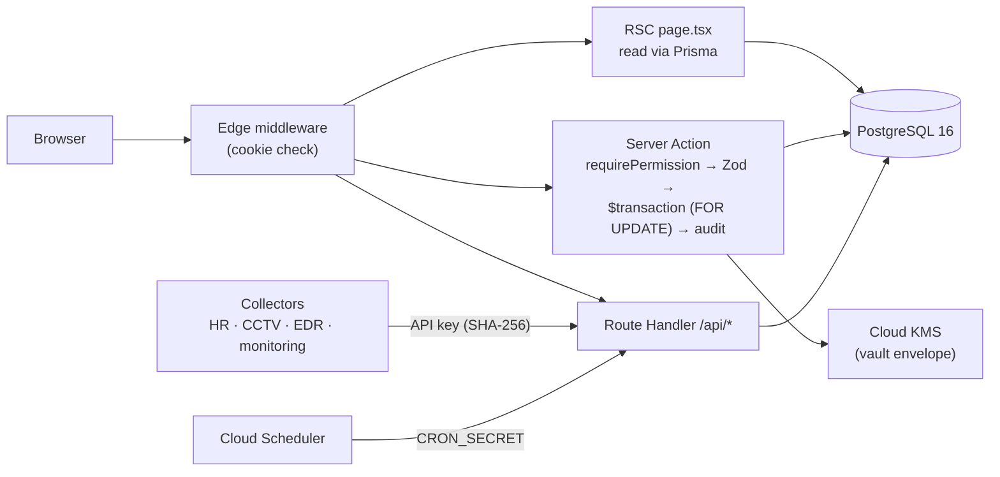
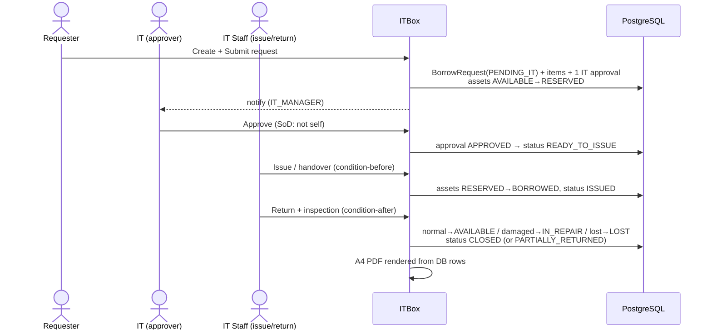

# Architecture

## 1. Overview

ITBox is a single Next.js 15 application (App Router) backed by PostgreSQL via
Prisma. It renders server-first (React Server Components), mutates through
**Server Actions** and a small set of **Route Handlers** (REST), and runs as a
stateless container on Google Cloud Run. The database is the single source of
truth; the container holds no durable state.

```
Browser ──► Next.js (Cloud Run)
              ├─ RSC pages  (read models via Prisma)
              ├─ Server Actions (mutations, permission-gated, audited)
              ├─ Route Handlers /api/* (REST: ingest, exports, cron, auth)
              └─ NextAuth (session, MFA, WebAuthn)
                    │
                    ▼
              PostgreSQL 16 (Cloud SQL)  ── Prisma 6 client
                    ▲
        API-key ingest (HR / CCTV / EDR / monitoring / inventory / KB)
        Cloud Scheduler ──► /api/cron/* (CRON_SECRET)
        Google Cloud KMS ──► envelope keys for the vault
```

### Request flow



### Borrow approval sequence



## 2. Layering

| Layer | Location | Responsibility |
|---|---|---|
| **Pages (RSC)** | `src/app/(app)/**/page.tsx` | Read models, render UI, gate on permissions. |
| **Server Actions** | `src/app/(app)/**/actions.ts` | Validated mutations (`"use server"`), audit, revalidate/redirect. |
| **Route Handlers** | `src/app/api/**/route.ts` | REST: auth, ingest pipelines, file exports, cron, PDFs/QR. |
| **Service layer** | `src/lib/services/*`, `src/lib/borrow/*` | Reusable domain logic (SLA engine, support numbering, borrow workflow). |
| **Platform libs** | `src/lib/*` | `prisma`, `session`, `permissions`, `audit`, `kms`, `envelope`, `ingest-auth`, `cron-auth`, `i18n`. |
| **UI** | `src/components/*` | Radix-based primitives, shell/sidebar, shared widgets. |
| **Data** | `prisma/schema.prisma`, `prisma/migrations/*` | Schema + migration history. |

**Rule of thumb:** a page reads; an action writes. Actions call
`requirePermission(...)`, run inside a Prisma `$transaction` with
`SELECT … FOR UPDATE` where concurrency matters, then `auditLog(...)` and
`revalidatePath(...)`.

## 3. Authentication & session

- **NextAuth v5 (Auth.js)** with the Prisma adapter. JWT session cookie; the
  edge middleware (`src/middleware.ts`) does a cookie-only check, and
  `getCurrentUser()` does the authoritative server-side check (session
  revocation via `UserSession.tokenId`/`jti`, user status, org, roles,
  permissions) on every request.
- **Providers:** Credentials (Argon2id), Google OAuth, Microsoft Entra ID (opt-in).
- **MFA:** TOTP (`otpauth`) and **WebAuthn/passkeys** (`@simplewebauthn`), enforced on sensitive actions (e.g. vault reveal).

## 4. RBAC

Permissions are a **database catalog**, not hard-coded:

- `Permission` (global keys like `asset:read`, `borrow:approve`) →
  `RolePermission` → `Role` (per-org, e.g. `SUPER_ADMIN`, `IT_MANAGER`) →
  `UserRole` → `User`.
- `getCurrentUser()` flattens the user's roles into a `Set<permissionKey>`.
- Pages/actions call `requirePermission("x:y")` or `user.permissions.has(...)`.
- The canonical role→permission defaults live in `src/lib/permissions.ts` and the
  **seed** (`prisma/seed.ts`); a running org's grants live in the DB and are
  changed via Settings → Roles or a data migration.

> Because grants live in the DB, adding a new permission key in code requires a
> **migration or re-seed** to grant it to existing orgs (see
> `20260902130000_borrow_permissions_grant`). New keys are otherwise invisible.

## 5. Adapters (pluggable infrastructure)

| Concern | Interface | Implementations |
|---|---|---|
| **Secret encryption** | `src/lib/kms.ts` | Google Cloud KMS (prod) · local dev key. Envelope crypto in `src/lib/envelope.ts` (AES-256-GCM DEK wrapped by KMS). |
| **File storage** | storage lib | GCS (`STORAGE_PROVIDER=gcs`) · local disk (dev). |
| **Email** | `src/lib/services/email.ts` | SMTP via `nodemailer` (no-op if unconfigured). |
| **Notifications** | `Notification` + `src/lib/services/notify.ts` | in-app (DB), email digest, LINE push (optional). |

## 6. The intake (ingest) pipeline

External collectors push data in over authenticated REST endpoints under
`/api/*/ingest` (plus HR sync and KB import). Characteristics:

- **Auth:** API key presented as `x-api-key` or `Authorization: Bearer`. The key
  is matched by **SHA-256 hash** against a `SystemSetting` per org
  (`resolveIngestOrg(req, {keys})` in `src/lib/ingest-auth.ts`). Different
  pipelines use different keys (e.g. `hr.ingest` vs the shared `itreport.ingest`).
- **Client IP:** `clientIp(req)` trusts the right-most `INGEST_TRUSTED_PROXIES`
  hops of `X-Forwarded-For`.
- **Middleware allowlist:** ingest routes are exempt from the session gate in
  `src/auth.config.ts` (they authenticate by API key instead).
- **Pipelines:** HR employee sync (`/api/hr/employees/sync`), CCTV collector
  (`/api/cctv/ingest`, `/snapshot`, `/commands`), IT health report
  (`/api/it-report/ingest`), EDR (`/api/edr/ingest`), monitoring
  (`/api/monitoring/ingest`), inventory (`/api/inventory/ingest`), KB import
  (`/api/kb/import`).

## 7. Scheduled jobs

Cloud Scheduler → Cloud Run POSTs, protected by `CRON_SECRET` (constant-time
compare, `src/lib/cron-auth.ts`):

- `/api/cron/checks` — **daily**: warranty/license/subscription/contract expiry,
  preventive-maintenance due, vault rotation due, **borrow due-soon/overdue**
  reminders, SLA sweep, email digest.
- `/api/cron/sla` — **every 5–15 min**: near-real-time SLA warnings/breaches/escalation.
- `/api/cron/cctv-daily` — **daily**: CCTV health report email.

## 8. Multi-tenancy

Every domain table carries `organizationId`. Reads filter by the caller's org;
detail pages `notFound()` on a cross-org id. There is no row-level DB policy —
isolation is enforced in the application layer and covered by the RBAC checks.

## 9. Runtime & build

- **Node 22-slim** Docker image, Next.js **standalone** output (`node server.js`).
- Container is stateless; uploads go to GCS in prod.
- See `DEPLOYMENT.md` for the Cloud Run/Cloud Build pipeline and `DATABASE.md`
  for the data model.
