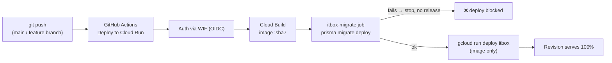

# Deployment Runbook

## Target

- **Platform:** Google Cloud Run (fully managed).
- **Project:** `itbox-505402` · **Region:** `asia-southeast1`
- **Service:** `itbox` · **Live URL:** https://itbox-ppjbzqdu3q-as.a.run.app
- **DB:** Cloud SQL for PostgreSQL 16 (connected via the Cloud SQL socket).
- **Image:** Node 22-slim, Next.js **standalone** output (`node server.js`).
- **Migrations:** a separate Cloud Run **job** `itbox-migrate` runs
  `prisma migrate deploy` before each release.

## CI/CD — automatic on push

Workflow: `.github/workflows/deploy.yml` (`Deploy to Cloud Run`).

- **Triggers:** push to `main` or `claude/enterprise-it-management-system-pz0u9s`
  (paths `**/*.md` and `docs/**` are ignored), or manual `workflow_dispatch`.
- **Auth:** GitHub OIDC → Workload Identity Federation (no long-lived keys).
  Secrets: `GCP_WIF_PROVIDER`, `GCP_DEPLOY_SA`.
- **Concurrency:** `group: deploy-cloud-run` (one at a time).

**Pipeline steps:**
1. Checkout + authenticate to GCP (WIF) + set up `gcloud`.
2. Compute image tag `…/itbox:${GITHUB_SHA::7}`.
3. **Build** the container with Cloud Build (`deploy/cloudbuild-ci.yaml`).
4. **Apply DB migrations:** update the `itbox-migrate` job to the new image and
   `gcloud run jobs execute itbox-migrate --wait` (runs `prisma migrate deploy`).
5. **Deploy** the service image-only (`gcloud run deploy itbox --image …`),
   keeping the service's env/secret/Cloud SQL wiring intact.
6. Print the service URL.

> Because migrations run as a gate, a **broken migration fails the deploy** before
> any new image serves traffic. Enum `ADD VALUE` migrations are safe in-transaction
> on PostgreSQL 12+ (values are not used in the same migration).

### Verifying a deploy
- GitHub → Actions → latest `Deploy to Cloud Run` run should be green, with step
  **"Apply database migrations"** and **"Deploy Cloud Run service"** both success.
- Or `gcloud run services describe itbox --region asia-southeast1 --format='value(status.url)'`.
- The revision line in logs looks like `itbox-00NNN-xxx … serving 100 percent`.

## One-time infrastructure setup

Run once by an owner (scripts in `deploy/`):

1. `deploy/gcp-deploy.sh` — provisions the project bits: Artifact Registry, the
   Cloud Run service + `itbox-migrate` job, Cloud SQL wiring, service accounts,
   and the initial env/secret bindings.
2. `deploy/setup-github-oidc.sh` — creates the Workload Identity pool/provider and
   the deploy service account, then prints the `GCP_WIF_PROVIDER` /
   `GCP_DEPLOY_SA` values to add as GitHub repo secrets.

See `deploy/README-github-actions.md` for the detailed setup walkthrough.

## Configuration (Cloud Run env / Secret Manager)

Set on the **service** and the **migrate job**. Never commit real values.

| Variable | Purpose |
|---|---|
| `DATABASE_URL` | Cloud SQL Postgres (via `?host=/cloudsql/PROJECT:REGION:INSTANCE`). |
| `AUTH_SECRET`, `AUTH_URL`, `AUTH_TRUST_HOST` | NextAuth. |
| `GOOGLE_CLIENT_ID/SECRET`, `AUTH_MICROSOFT_ENTRA_ID_*` | Optional SSO. |
| `CRON_SECRET` | Protects `/api/cron/*`. |
| `KMS_*` / GCP KMS binding | Vault envelope keys. |
| `STORAGE_PROVIDER=gcs`, bucket config | File uploads. |
| SMTP vars | Email notifications. |
| `INGEST_TRUSTED_PROXIES` | XFF hop count for ingest client IP. |
| Ingest API keys (`hr.ingest`, `itreport.ingest`, …) | Stored hashed in `SystemSetting`, set via Settings UI. |

## Scheduled jobs (Cloud Scheduler → Cloud Run)

Create HTTP jobs POSTing with `Authorization: Bearer $CRON_SECRET`:

| Schedule | Target |
|---|---|
| daily (e.g. 07:00) | `POST /api/cron/checks` |
| every 5–15 min | `POST /api/cron/sla` |
| daily | `POST /api/cron/cctv-daily` |

## Manual / emergency operations

- **Manual deploy:** Actions tab → `Deploy to Cloud Run` → *Run workflow*.
- **Manual migrate:** `gcloud run jobs execute itbox-migrate --region asia-southeast1 --wait`.
- **Roll back:** `gcloud run services update-traffic itbox --to-revisions itbox-00NNN-xxx=100 --region asia-southeast1`.
- **Seed a fresh org (non-prod):** `DATABASE_URL=… SEED_ADMIN_PASSWORD=… SEED_USER_PASSWORD=… npm run db:seed`.

## Notes

- The sandbox/CI environment may not be able to reach the Cloud Run service
  directly (org network policy); rely on the pipeline and Cloud Logging.
- Redeploying while users have tabs open can cause a transient server-action
  version-skew error — a full page reload fixes it (see `SECURITY.md`).
- See `GCP_DEPLOYMENT_REPORT.md` for what is currently running and verified.
