# Diagrams — full ERD & state machines

Rendered by GitHub's Mermaid support. Every table also carries `organizationId`
(the tenant key) and most carry `deletedAt` — these are omitted from the ER
diagrams for readability. See `DATABASE.md` for modeling decisions.

## Module map

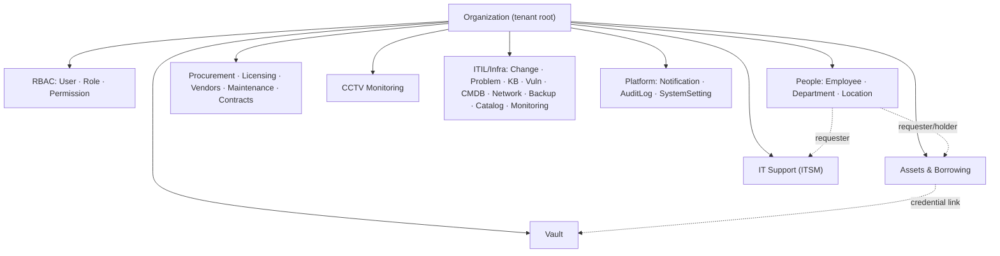

---

## ERD — Tenancy & RBAC

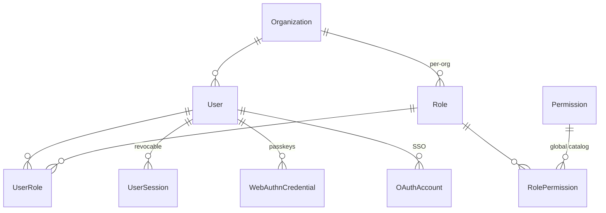

## ERD — People & HR

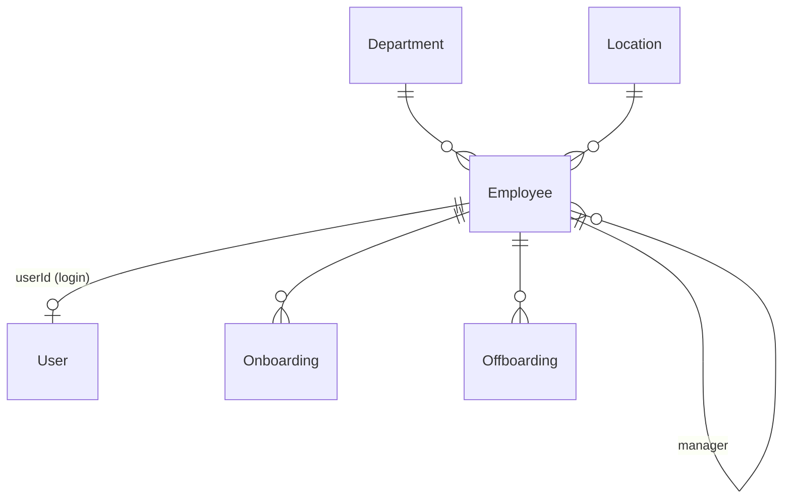

## ERD — Assets & custody

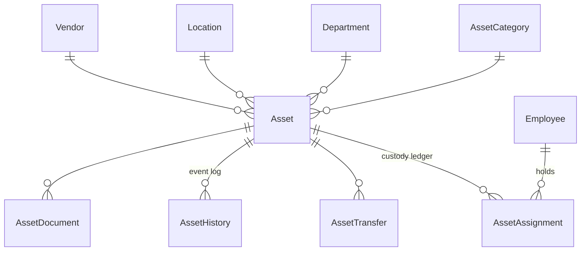

## ERD — Borrowing & return

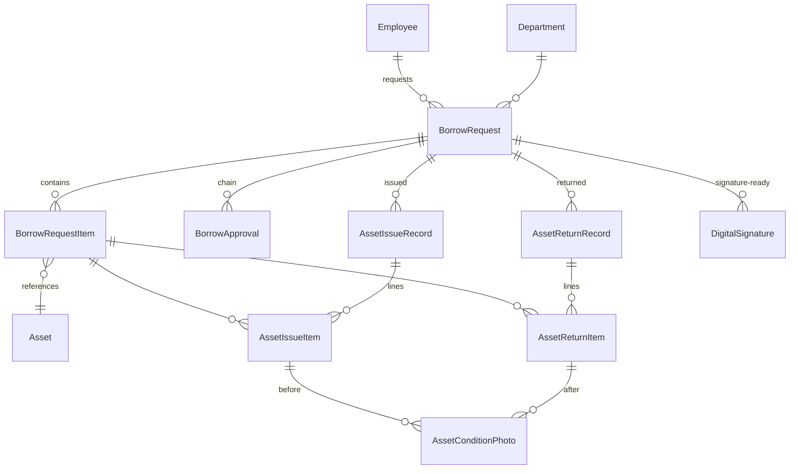

## ERD — Vault

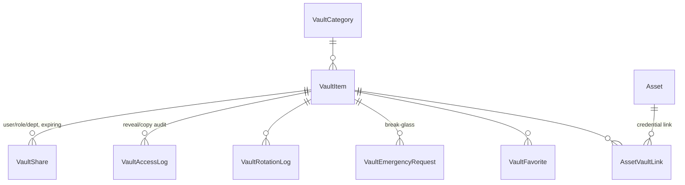

## ERD — IT Support (ITSM)

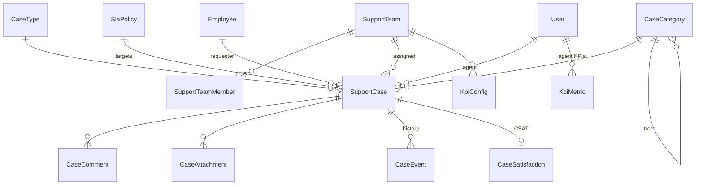

## ERD — Procurement · Licensing · Vendors · Maintenance · Contracts

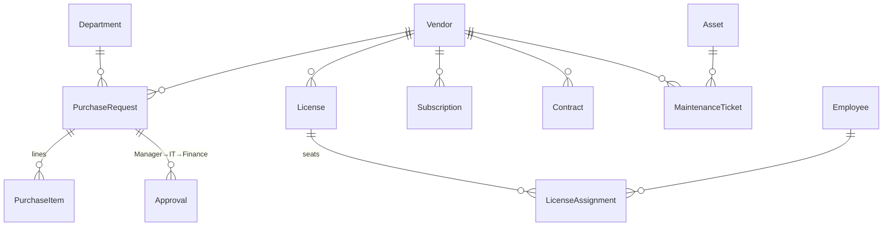

## ERD — CCTV monitoring

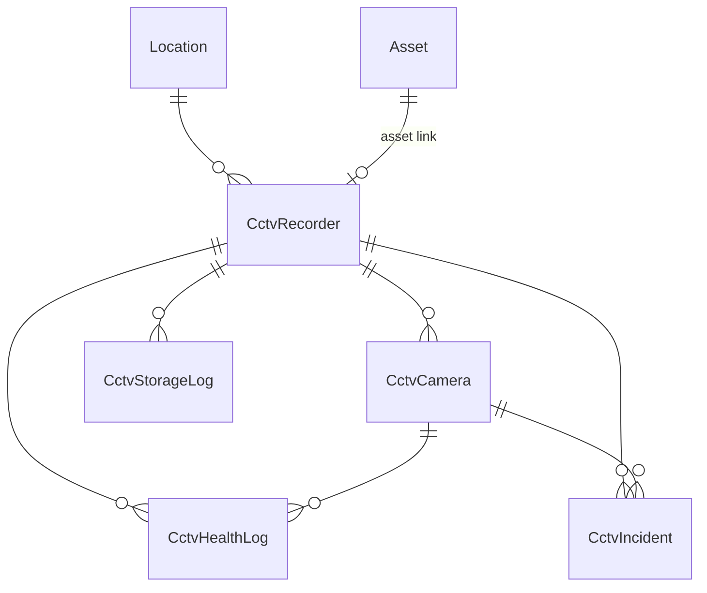

## ERD — ITIL / infrastructure

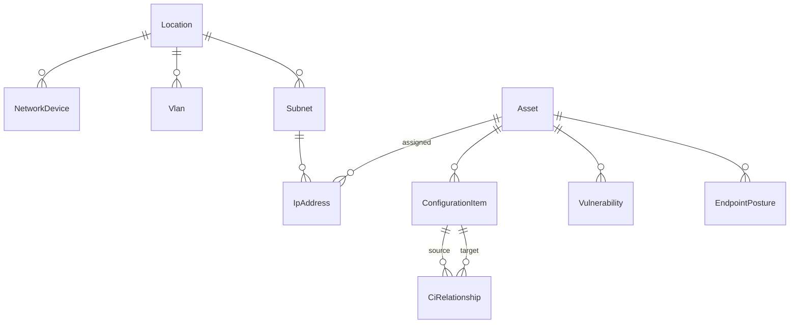

Standalone per-org registries (no strong FK beyond the tenant + optional
asset/vendor links): `ChangeRequest`, `Problem`, `KbArticle`, `BackupJob`,
`ServiceCatalogItem`, `MonitoringHost`, `ItHealthCheck` (+ `ItHealthEvidence`).

---

## State machine — Asset lifecycle (`AssetStatus`)

Combines permanent assignment, temporary borrowing, repair, and end-of-life.

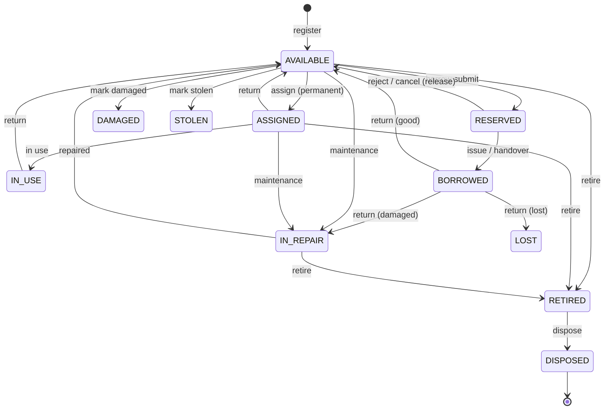

## State machine — Borrow request (`BorrowRequestStatus`)

Current workflow = **single IT approval**. "Due soon" / "Overdue" are **derived**
from `dueDate`, not stored. (The enum retains `PENDING_MANAGER` /
`PENDING_MANAGEMENT` / `APPROVED` for a configurable multi-step chain.)

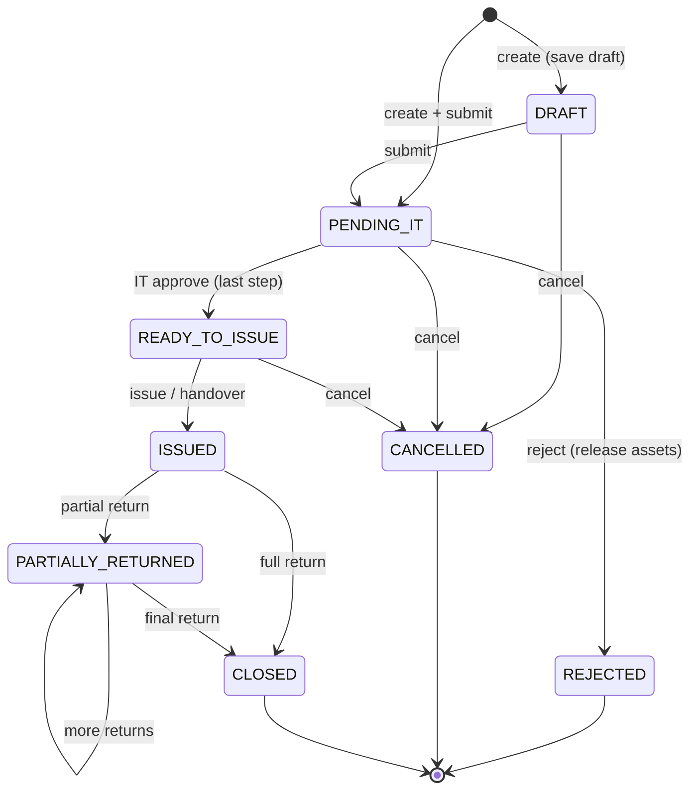

## State machine — Borrow item (`BorrowItemStatus`)

Per-asset line status, enabling partial returns.

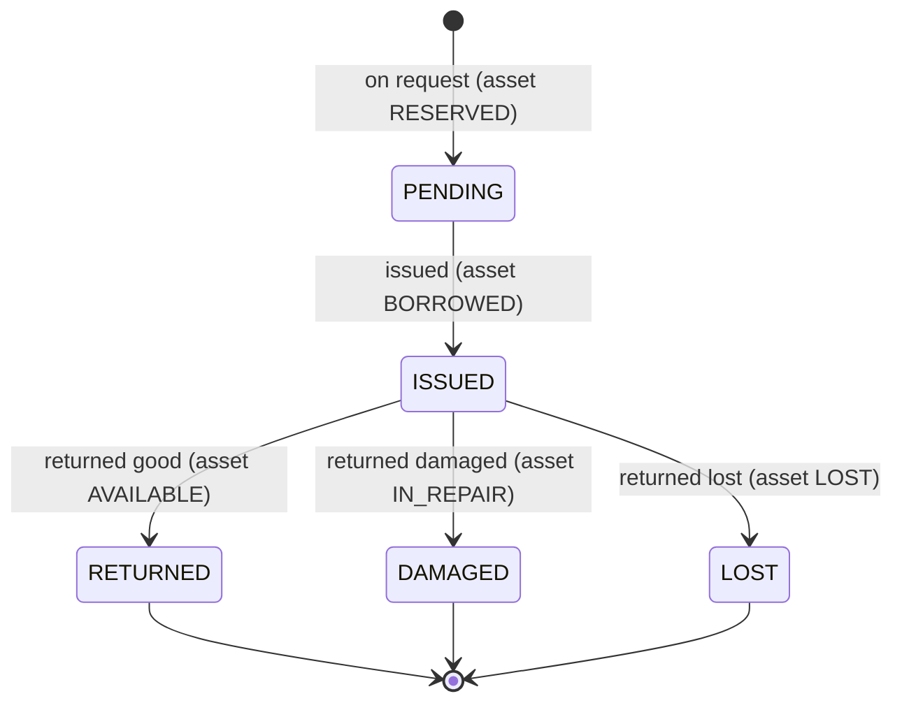

## State machine — Support case (`CaseStatus`)

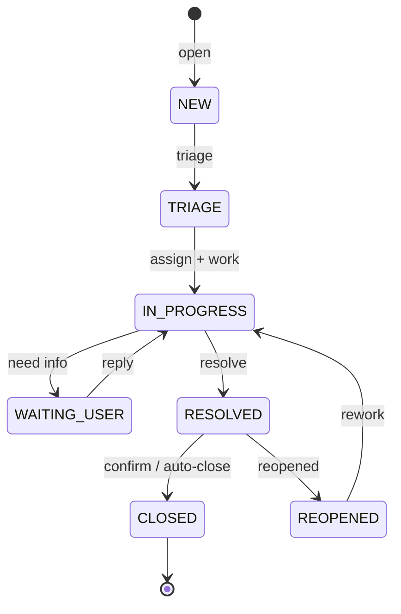
